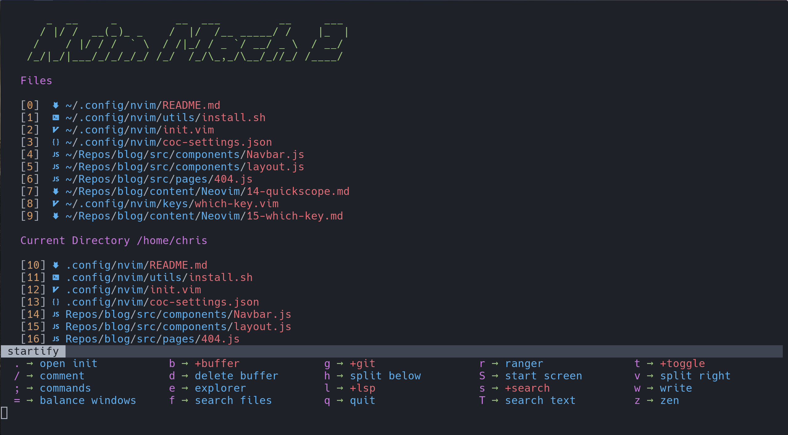

# Nvim Personal Build



## Install

The following will install this config if you have an existing config it will move it to `~/.config/nvim.old`

This script only supports Mac, Ubuntu and Arch

```
bash <(curl -s https://raw.githubusercontent.com/th3rring/nvim/master/utils/install.sh)
```

## Install clipboard support

```
sudo apt install xsel
```

## Language Servers

Since CoC doesn't support all languages in there extensions
I recommend installing some language servers from scratch
and adding them to your `coc-settings.json` file

Example:

- bash

  `npm i -g bash-language-server`

  ```
  "languageserver": {
  "bash": {
    "command": "bash-language-server",
    "args": ["start"],
    "filetypes": ["sh"],
    "ignoredRootPaths": ["~"]
    }
  }
  ```

## Credit

The original build of this configuration was made by Christian Chiarulli and can be found [here](https://github.com/ChristianChiarulli/nvim).
